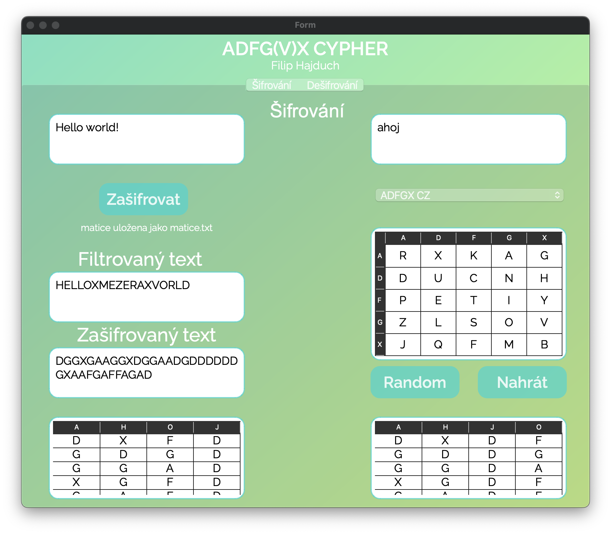

# ADFGVXCypher

ADFGVXCypher is a Python application that implements the ADFGVX cipher encryption and decryption algorithm. It includes a graphical user interface (GUI) built with PyQt6.

## 🎮 Features

- Encrypts and decrypts text using the ADFGVX cipher.
- Supports both ADFGX and ADFGVX variants.
- Handles Czech and English character encodings.
- Provides a user-friendly GUI for easy interaction.
- Allows random generation or uploading of cipher matrices.

## 🧠 GUI Overview

- **Zadejte text k šifrování**: Enter the text to be encrypted.
- **Zadejte klíč k šifrování**: Enter the key for encryption.
- **Zašifrovat**: Button to encrypt the text.
- **Filtrovaný text**: Displays the filtered text after preprocessing.
- **Zašifrovaný text**: Displays the encrypted text.
- **Random**: Button to generate a random cipher matrix.
- **Nahrát**: Button to upload a cipher matrix from a file.
- **Zadejte text k dešifrování**: Enter the text to be decrypted.
- **Zadejte klíč k dešifrování**: Enter the key for decryption.
- **Dešifrovat**: Button to decrypt the text.
- **Dešifrovaný text**: Displays the decrypted text.

## 📊 Example

### Encryption

1. Enter the text to be encrypted in the **Zadejte text k šifrování** field.
2. Enter the key for encryption in the **Zadejte klíč k šifrování** field.
3. Generate or upload a cipher matrix using the **Random** or **Nahrát** button.
4. Click the **Zašifrovat** button.
5. The filtered text will be displayed in the **Filtrovaný text** field.
6. The encrypted text will be displayed in the **Zašifrovaný text** field.

### Decryption

1. Enter the text to be decrypted in the **Zadejte text k dešifrování** field.
2. Enter the key for decryption in the **Zadejte klíč k dešifrování** field.
3. Upload the cipher matrix used for encryption using the **Nahrát** button.
4. Click the **Dešifrovat** button.
5. The decrypted text will be displayed in the **Dešifrovaný text** field.

---

#### Author: Filip Hajduch
###### and GitHub Copilot